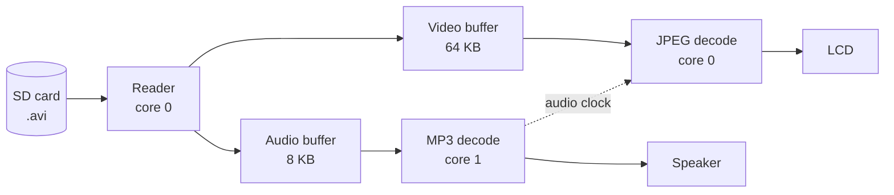

# frost

A video player for the M5Stack Cardputer ADV. Plays `.avi` files (MJPEG video + MP3 audio) at 240×135, converted with ffmpeg


**snowflake** is procedurally generated

## Quick start

1. Put `frost-convert.py` in a folder with your `.mp4` / `.mkv` files and run it (requires `ffmpeg`).
2. Copy the `.avi` files from `frost-out/` to `/Movie` on the SD card.
3. Boot frost, press `Fn`+`S` to scan titles, pick a video.

converter defaults: 20 fps, quality 6, 8 KB frame cap.

## How it works



a reader owns the SD card and fills two buffers. Audio and video decode only from RAM. Video frames are timed against the audio; late frames are skipped. Audio decode takes the highest priority (personally audio stutters are way more unbearable)

## Controls

Arrow keys: `;` up, `.` down, `,` left, `/` right.

`Space` Pause / resume
`0`–`9` Jump to 0%–90%
`Fn`+`←` / `→` Seek −/+ 2%
`]` / `[` Next / previous video
`=` / `-` Volume (with `Fn`: brightness)
`s` Stop
`m` Mute
`r` Repeat current video
`\` Shuffle
`v` Video off / on (audio keeps playing)
`h` Half frame rate
`i` Title and position
`d` Debug overlay
`n` / `b` Next / previous frame (while paused)
`Fn`+`[` / `]` Audio sync −/+ 20 ms
`Fn`+`S` Scan titles
`←` Fullscreen: back to browser, keeps playing

In the browser: `↑` `↓` move, `→` open or play (also queues all videos in the directory) , `←` parent folder, `Enter` go back to the player/video, `'` add to queue, `Fn`+`'` play next.

## Settings

Edit `/.frost/config` on the SD card. Delete it to restore defaults.

| Key | Default | Meaning |
|---|---|---|
| `movie_dir` | `/Movie` | Video folder |
| `brightness` | `255` | 0–255 |
| `screen_timeout` | `30000` | ms before the screen sleeps, 0 = never |
| `accent` | `FFFFFF` | Hex color |
| `background` | `000000` | Hex color |
| `shuffle` | `0` | 0 or 1 |
| `av_offset` | `80` | Audio sync, ms |
| `boot_animation` | `1` | 0 or 1 |

## Debug overlay (`d`)

| Field | Meaning |
|---|---|
| `fps` | Frames drawn last second |
| `drop` | Frames skipped |
| `dec` | ms to decode and draw one frame |
| `aw` | ms the audio waited for data (should be 0) |
| `vq` | Bytes in the video buffer |

## Limitations

- `.avi` with MJPEG + MP3 only. Use the converter.
- ffmpeg splits blocks above 1GB files. frost runs fine but videos end prematurely
- 20-25 fps is the practical maximum.


## Build

```
git clone https://github.com/wisnc/frost
cd frost
pio run
```
